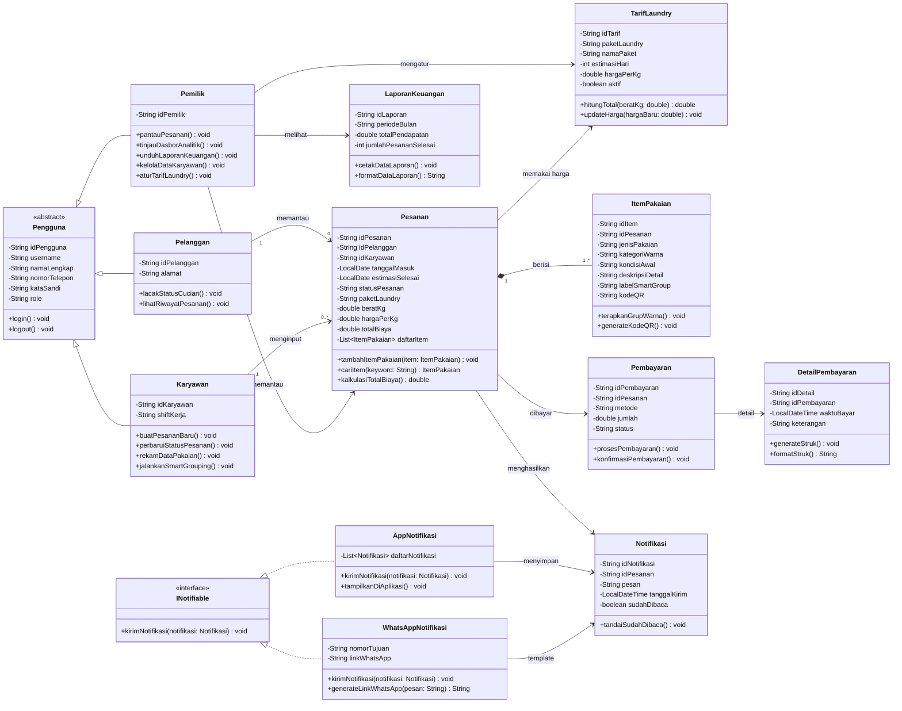

# SILAUNDRY - Sistem Informasi Manajemen Laundry


Sistem Informasi Manajemen Laundry berbasis desktop untuk UMKM dengan fitur **Monitoring Pesanan** dan **Smart Grouping**.

## 📋 Deskripsi Proyek

SILAUNDRY adalah aplikasi desktop Java yang dirancang untuk mengatasi masalah operasional utama usaha laundry UMKM: **tingginya risiko pakaian pelanggan yang tertukar**. Meskipun klaim layanan "1 mesin 1 pelanggan", keterbatasan kapasitas memaksa pencampuran pakaian dari berbagai pelanggan, yang mengakibatkan kerugian materi dan menurunnya kepercayaan pelanggan.

### 🎯 Solusi Teknis Utama

1. **Monitoring Pesanan**
   - Pelanggan memantau pesanan aktif dan riwayat miliknya
   - Pemilik memantau seluruh pesanan melalui filter status
   - Memastikan tidak ada identitas pakaian yang hilang meski dicampur dalam satu mesin

2. **Smart Grouping**
   - Sortir otomatis cucian berdasarkan kategori warna
   - Rekomendasi pengelompokan untuk mencegah kerusakan/kelunturan
   - Optimasi proses pencucian massal

## 🏗️ Domain & Ruang Lingkup

**Domain**: Sistem Informasi Manajemen Operasional Jasa  
**Fokus**: Manajemen alur kerja dan pelacakan aset/inventori sementara (pakaian pelanggan) dalam skala UMKM

### Ruang Lingkup Sistem

- ✅ **User Management**: Owner, Karyawan, Pelanggan
- ✅ **Order Management**: CRUD pesanan, pencatatan jenis pakaian, kalkulasi harga, dan status proses
- ✅ **Smart Grouping**: Logika back-end untuk sortir otomatis berdasarkan warna
- ✅ **Monitoring**: Akses informasi status bagi pelanggan dan performa bagi owner

### Batasan Sistem

- ❌ Tidak terintegrasi dengan hardware mesin cuci fisik
- ❌ Tidak mencakup modul manajemen kurir/pengiriman
- ❌ Tidak menyertakan manajemen gaji dan inventori bahan baku
- ❌ Fokus pada pemantauan transaksi, bukan payment gateway

## 🏛️ Core Class Diagram




### Final Class Diagram

Diagram ini merepresentasikan struktur implementasi SiLaundry setelah penyederhanaan tingkat menengah. Getter, setter, constructor, dan method helper rutin tidak seluruhnya ditampilkan agar relasi utama tetap terbaca.

```mermaid
classDiagram
direction LR

class Pengguna {
  <<abstract>>
  -String idPengguna
  -String username
  -String namaLengkap
  -String nomorTelepon
  -String kataSandi
  -Role role
  +login() void
  +logout() void
}

class Pelanggan {
  -String idPelanggan
  -String alamat
  +lacakStatusCucian() void
  +lihatRiwayatPesanan() void
}

class Karyawan {
  -String idKaryawan
  -String shiftKerja
  +buatPesananBaru() void
  +perbaruiStatusPesanan() void
  +rekamDataPakaian() void
  +jalankanSmartGrouping() void
}

class Pemilik {
  -String idPemilik
  +pantauPesanan() void
  +lihatDaftarPelanggan() void
  +tinjauDasborAnalitik() void
  +unduhLaporanKeuangan() void
  +kelolaDataKaryawan() void
}

class Pesanan {
  -String idPesanan
  -String idPelanggan
  -String namaPelanggan
  -String idKaryawan
  -String namaKaryawan
  -LocalDate tanggalMasuk
  -LocalDate estimasiSelesai
  -StatusPesanan statusPesanan
  -PaketLaundry paketLaundry
  -double beratKg
  -double hargaPerKg
  -double totalBiaya
  -String catatan
  -List~ItemPakaian~ daftarItem
  +tambahItemPakaian(item: ItemPakaian) void
  +kalkulasiTotalBiaya() double
}

class TarifLaundry {
  -String idTarif
  -PaketLaundry paketLaundry
  -String namaPaket
  -int estimasiHari
  -double hargaPerKg
  -boolean aktif
  +hitungTotal(beratKg: double) double
}

class ItemPakaian {
  -String idItem
  -String idPesanan
  -String jenisPakaian
  -KategoriWarna kategoriWarna
  -String kondisiAwal
  -String deskripsiDetail
  -String labelSmartGroup
  +terapkanGrupWarna() void
}

class Pembayaran {
  -String idPembayaran
  -String idPesanan
  -String metode
  -double jumlah
  -StatusPembayaran status
  +prosesPembayaran() void
}

class INotifiable {
  <<interface>>
  +kirimNotifikasi(notifikasi: Notifikasi) void
}

class Notifikasi {
  -String idNotifikasi
  -String idPesanan
  -String pesan
  -LocalDateTime tanggalKirim
  -boolean sudahDibaca
}

class AppNotifikasi {
  +kirimNotifikasi(notifikasi: Notifikasi) void
  +tampilkanDiAplikasi(notifikasi: Notifikasi) String
}

class WhatsAppNotifikasi {
  -String nomorTujuan
  -String linkWhatsApp
  +kirimNotifikasi(notifikasi: Notifikasi) void
  +generateLinkWhatsApp(pesan: String) String
}

class DataDasbor {
  -String idDasbor
  -int totalPesananAktif
  -double estimasiPendapatan
  -double pendapatanDiterima
  -int totalItem
  -int totalPelanggan
  +perbaruiMetrikHarian(totalAktif: int, estimasi: double, diterima: double, totalItem: int, totalPelanggan: int) void
}

class LaporanKeuangan {
  -String idLaporan
  -String periodeBulan
  -double totalPendapatan
  -int jumlahPesananSelesai
  +cetakDataLaporan() void
  +formatDataLaporan() String
}

class SmartGroupingService {
  -ItemPakaianDAO itemPakaianDAO
  +labelFor(kategoriWarna: KategoriWarna) String
  +kelompokkanItem(pesanan: Pesanan) void
  +kelompokkanItem(idPesanan: String) int
}

class AuthController {
  -UserDAO userDAO
  +login(username: String, password: String, role: Role) Pengguna
  +testConnection() String
}

class PenggunaController {
  -UserDAO userDAO
  +getAllPelanggan() List~Pelanggan~
  +getAllKaryawan() List~Karyawan~
  +getDefaultKaryawanId() String
  +tambahPelanggan(username: String, nama: String, telepon: String, password: String, alamat: String) void
  +tambahKaryawan(username: String, nama: String, telepon: String, password: String, shift: String) void
  +hapusKaryawan(idKaryawan: String) void
}

class PesananController {
  -PesananDAO pesananDAO
  -TarifLaundryDAO tarifLaundryDAO
  -ItemPakaianDAO itemPakaianDAO
  -PembayaranDAO pembayaranDAO
  -NotifikasiController notifikasiController
  +getAllPesanan() List~Pesanan~
  +getPesananPelanggan(idPelanggan: String) List~Pesanan~
  +getPesanan(idPesanan: String) Pesanan
  +tambahPesanan(idPelanggan: String, idKaryawan: String, paketLaundry: PaketLaundry, beratKg: double, catatan: String) Pesanan
  +updateStatus(idPesanan: String, statusPesanan: StatusPesanan) boolean
  +batalkanPesanan(idPesanan: String) boolean
}

class ItemController {
  -ItemPakaianDAO itemPakaianDAO
  -PesananDAO pesananDAO
  -SmartGroupingService smartGroupingService
  +getAllItems() List~ItemPakaian~
  +getItemsByPesanan(idPesanan: String) List~ItemPakaian~
  +tambahItem(idPesanan: String, jenis: String, warna: KategoriWarna, kondisi: String, deskripsi: String) void
  +jalankanSmartGrouping(idPesanan: String) int
  +hapusItem(idItem: String) void
}

class TarifController {
  -TarifLaundryDAO tarifLaundryDAO
  +getSemuaTarif() List~TarifLaundry~
  +getTarifAktif() List~TarifLaundry~
  +getTarif(paketLaundry: PaketLaundry) TarifLaundry
  +updateHarga(paketLaundry: PaketLaundry, hargaPerKg: double) void
}

class PembayaranController {
  -PembayaranDAO pembayaranDAO
  -PesananDAO pesananDAO
  +getPembayaran(idPesanan: String) Pembayaran
  +catatPembayaran(idPesanan: String, metode: String) Pembayaran
}

class NotifikasiController {
  -NotifikasiDAO notifikasiDAO
  -PesananDAO pesananDAO
  -AppNotifikasi appNotifikasi
  +getNotifikasiPelanggan(idPelanggan: String) List~Notifikasi~
  +tandaiSemuaDibaca(idPelanggan: String) int
  +kirimNotifikasiStatus(pesanan: Pesanan) void
  +buatLinkWhatsApp(idPesanan: String) String
}

class DashboardController {
  -DashboardDAO dashboardDAO
  +getDataDasbor() DataDasbor
  +getLaporanBulanIni() LaporanKeuangan
}

class UserDAO {
  <<DAO>>
  +authenticate(username: String, passwordHash: String, role: Role) Pengguna
  +findAllPelanggan() List~Pelanggan~
  +findAllKaryawan() List~Karyawan~
  +createPelanggan(pelanggan: Pelanggan) void
  +createKaryawan(karyawan: Karyawan) void
  +deleteKaryawan(idKaryawan: String) void
}

class PesananDAO {
  <<DAO>>
  +findAll() List~Pesanan~
  +findByPelanggan(idPelanggan: String) List~Pesanan~
  +findById(idPesanan: String) Pesanan
  +create(pesanan: Pesanan) void
  +updateStatus(idPesanan: String, status: StatusPesanan) void
  +updateStatusDanNotifikasi(idPesanan: String, statusLama: StatusPesanan, statusBaru: StatusPesanan, notifikasi: Notifikasi) void
}

class ItemPakaianDAO {
  <<DAO>>
  +findByPesanan(idPesanan: String) List~ItemPakaian~
  +findById(idItem: String) ItemPakaian
  +countByPesanan(idPesanan: String) int
  +create(item: ItemPakaian) void
  +updateSmartGroups(items: List~ItemPakaian~) void
  +delete(idItem: String) void
}

class TarifLaundryDAO {
  <<DAO>>
  +findAll() List~TarifLaundry~
  +findActive() List~TarifLaundry~
  +findByPaket(paket: PaketLaundry) TarifLaundry
  +updateHarga(paket: PaketLaundry, hargaPerKg: double) void
}

class PembayaranDAO {
  <<DAO>>
  +findByPesanan(idPesanan: String) Pembayaran
  +create(pembayaran: Pembayaran) void
}

class NotifikasiDAO {
  <<DAO>>
  +create(notifikasi: Notifikasi) void
  +create(connection: Connection, notifikasi: Notifikasi) void
  +findByPelanggan(idPelanggan: String) List~Notifikasi~
  +findNomorTeleponByPesanan(idPesanan: String) String
  +exists(idPesanan: String, pesan: String) boolean
  +exists(connection: Connection, idPesanan: String, pesan: String) boolean
  +markAllReadByPelanggan(idPelanggan: String) int
}

class DashboardDAO {
  <<DAO>>
  +getDataDasbor() DataDasbor
  +getLaporanBulanIni() LaporanKeuangan
}

class DatabaseConnection {
  <<utility>>
  +getConnection() Connection
  +testConnection() String
}

class PasswordUtil {
  <<utility>>
  +hash(plainText: String) String
  +matches(plainText: String, hashed: String) boolean
}

class IdGenerator {
  <<utility>>
  +generate(prefix: String) String
}

class Main
class LoginFrame {
  <<view>>
}
class MainFrame {
  <<view>>
}
class KaryawanPanel {
  <<view>>
  +refreshData() void
}
class PemilikPanel {
  <<view>>
  +refreshData() void
}
class PelangganPanel {
  <<view>>
}
class AppTheme {
  <<utility>>
}
class UiUtil {
  <<utility>>
}

class Role {
  <<enumeration>>
  PEMILIK
  KARYAWAN
  PELANGGAN
}

class StatusPesanan {
  <<enumeration>>
  BARU
  DIPROSES
  DICUCI
  DIKERINGKAN
  DISETRIKA
  SIAP_DIAMBIL
  SELESAI
  DIBATALKAN
  +dapatBerubahKe(statusBaru: StatusPesanan) boolean
  +membutuhkanItemPakaian() boolean
  +dapatMengubahItem() boolean
  +dapatMenerimaPembayaran() boolean
  +isFinal() boolean
}

class PaketLaundry {
  <<enumeration>>
  STANDARD_2_HARI
  EXPRESS_1_HARI
}

class KategoriWarna {
  <<enumeration>>
  PUTIH
  TERANG
  GELAP
  MUDAH_LUNTUR
}

class StatusPembayaran {
  <<enumeration>>
  BELUM_BAYAR
  LUNAS
}

Pengguna <|-- Pelanggan
Pengguna <|-- Karyawan
Pengguna <|-- Pemilik
Pengguna --> Role

INotifiable <|.. AppNotifikasi
INotifiable <|.. WhatsAppNotifikasi

Pelanggan "1" --> "0..*" Pesanan : memantau
Karyawan "1" --> "0..*" Pesanan : menginput/mengelola
Pesanan "1" *-- "0..*" ItemPakaian : berisi
Pesanan "1" --> "0..1" Pembayaran : memiliki
Pesanan "1" --> "0..*" Notifikasi : menghasilkan
Pesanan --> StatusPesanan
Pesanan --> PaketLaundry
Pesanan ..> TarifLaundry : snapshot harga
TarifLaundry --> PaketLaundry
ItemPakaian --> KategoriWarna
Pembayaran --> StatusPembayaran
Notifikasi --> Pesanan

Pemilik ..> DataDasbor : memantau
Pemilik ..> LaporanKeuangan : mengakses
Pemilik ..> Pesanan : memantau
Pemilik ..> TarifController : mengatur tarif
TarifController --> TarifLaundryDAO
TarifLaundryDAO --> TarifLaundry

AuthController --> UserDAO
PenggunaController --> UserDAO
PesananController --> PesananDAO
PesananController --> TarifLaundryDAO
PesananController --> ItemPakaianDAO
PesananController --> PembayaranDAO
PesananController --> NotifikasiController
ItemController --> ItemPakaianDAO
ItemController --> PesananDAO
ItemController --> SmartGroupingService
PembayaranController --> PembayaranDAO
PembayaranController --> PesananDAO
NotifikasiController --> NotifikasiDAO
NotifikasiController --> PesananDAO
NotifikasiController --> INotifiable
DashboardController --> DashboardDAO

UserDAO --> Pengguna
UserDAO --> Pelanggan
UserDAO --> Karyawan
UserDAO --> Pemilik
PesananDAO --> Pesanan
ItemPakaianDAO --> ItemPakaian
PembayaranDAO --> Pembayaran
NotifikasiDAO --> Notifikasi
DashboardDAO --> DataDasbor
DashboardDAO --> LaporanKeuangan

AppNotifikasi --> NotifikasiDAO
SmartGroupingService --> ItemPakaianDAO
SmartGroupingService ..> Pesanan

UserDAO ..> DatabaseConnection
PesananDAO ..> DatabaseConnection
ItemPakaianDAO ..> DatabaseConnection
TarifLaundryDAO ..> DatabaseConnection
PembayaranDAO ..> DatabaseConnection
NotifikasiDAO ..> DatabaseConnection
DashboardDAO ..> DatabaseConnection

AuthController ..> PasswordUtil
PenggunaController ..> PasswordUtil
PenggunaController ..> IdGenerator
PesananController ..> IdGenerator
ItemController ..> IdGenerator

Main --> LoginFrame
LoginFrame --> AuthController
LoginFrame --> PenggunaController
MainFrame --> PemilikPanel
MainFrame --> KaryawanPanel
MainFrame --> PelangganPanel
KaryawanPanel --> PesananController
KaryawanPanel --> ItemController
KaryawanPanel --> PembayaranController
KaryawanPanel --> NotifikasiController
PemilikPanel --> DashboardController
PemilikPanel --> PenggunaController
PemilikPanel --> PesananController
PemilikPanel --> TarifController
PelangganPanel --> PesananController
PelangganPanel --> NotifikasiController
LoginFrame ..> AppTheme
MainFrame ..> AppTheme
KaryawanPanel ..> UiUtil
PemilikPanel ..> UiUtil
PelangganPanel ..> UiUtil
```



### Penjelasan Modul

**Modul A: Aktor dan Manajemen Pengguna**
- `Pengguna` (Abstract Class) sebagai parent class
- `Pelanggan`, `Karyawan`, `Pemilik` sebagai child classes dengan fungsi spesifik

**Modul B: Operasional Bisnis**
- `Pesanan` - Pusat data transaksi laundry
- `ItemPakaian` - Representasi digital setiap pakaian
- `SmartGroupingService` - Service pengelompokan otomatis
- `ItemController` - Pencatatan detail dan pengelompokan pakaian

**Modul C: Layanan Sistem**
- `Pembayaran` - Pencatatan pembayaran lunas per pesanan
- `INotifiable`, `AppNotifikasi`, `WhatsAppNotifikasi`, dan `Notifikasi` - Sistem notifikasi aplikasi dan template link WhatsApp
- `DataDasbor` - Dashboard metrik real-time
- `LaporanKeuangan` - Laporan keuangan periodik


## 👥 Tim Pengembang

**Kelompok**: Asli Loh Yak

| Nama | Peran |
|------|-------|
| Fanan Agfian Mozart | Project Manager & Initiator |
| Ammar Farras Hanindhiya Bastian | Class Diagram Designer |
| Naufal Indra Washikita | Dokumentasi Tujuan & Modul B |
| Mikael Bramantyo Hastungkoro | Dokumentasi Modul A & C |
| Grace Jessica | Pendahuluan, Visualisasi, Relasi |

## 🛠️ Tech Stack

- **Language**: Java
- **IDE**: Apache NetBeans
- **Paradigm**: Object-Oriented Programming (OOP)
- **GUI**: Java Swing/AWT
- **Database**: MySQL/XAMPP via JDBC
- **Design Pattern**: MVC (Model-View-Controller)

## 🚀 Cara Menjalankan

1. **Clone repository**
```bash
   git clone https://github.com/Mozartzx/silaundry.git
   cd silaundry
```

2. **Siapkan database**
   - Jalankan MySQL dari XAMPP
   - Import file `database/silaundry_schema.sql` melalui phpMyAdmin atau MySQL client
   - Jika username/password MySQL berbeda, ubah `config/db.properties`
   - Untuk database versi lama, lakukan backup bila diperlukan lalu import ulang `database/silaundry_schema.sql`

3. **Siapkan JDBC driver**
   - Unduh MySQL Connector/J
   - Letakkan file `.jar` di folder `lib/`
   - Rename menjadi `mysql-connector-j.jar`

4. **Buka di NetBeans**
   - File → Open Project
   - Pilih folder SILAUNDRY

5. **Build & Run**
   - Klik kanan pada project → Clean and Build
   - Run Main File
   - Hasil build dapat dijalankan langsung dengan `java -jar dist/SILaundry.jar`
   - Saat build, Connector/J otomatis disalin ke `dist/lib/mysql-connector-j.jar`

6. **Jalankan pengujian**
   - Unit test aturan bisnis: target Ant `test`
   - Integration test database: target Ant `integration-test` setelah database siap
   - Dari terminal dengan Ant tersedia: `ant clean test integration-test jar`

### Akun Awal Presentasi

| Role | Nama | Username | Password |
|------|------|----------|----------|
| Pemilik | `Master Admin` | `Master` | `123` |

Catatan:
- Database awal hanya berisi satu akun pemilik sebagai super admin. Tidak ada akun karyawan, pelanggan, atau transaksi dummy.
- Role pemilik hanya disediakan satu akun awal dan tidak dibuat dari menu register.
- Karyawan ditambahkan dari dashboard pemilik.
- Pelanggan dapat membuat akun sendiri melalui tombol **Daftar Pelanggan** di halaman login.
- Struktur database memakai `pengguna` sebagai tabel parent untuk login/role, sedangkan `pelanggan`, `karyawan`, dan `pemilik` hanya menyimpan atribut khusus masing-masing role.
- Tarif laundry dikelola oleh pemilik dari menu **Tarif Laundry**:
  - Standard 2 Hari: default Rp7.000/kg
  - Express 1 Hari: default Rp8.000/kg
- Total biaya pesanan dihitung otomatis dari `berat_kg x harga_per_kg`; karyawan dan pelanggan tidak menginput total manual.
- Karyawan dapat mencatat jenis pakaian, kategori warna, kondisi awal, dan deskripsi detail per item untuk mengurangi risiko pakaian tertukar.

### Alur Presentasi yang Disarankan

1. Login sebagai pemilik dengan akun `Master` / `123`.
2. Tambahkan satu akun karyawan melalui menu **Kelola Karyawan**.
3. Logout, lalu buat satu akun pelanggan melalui tombol **Daftar Pelanggan**.
4. Login sebagai karyawan dan buat pesanan untuk pelanggan tersebut.
5. Tambahkan detail item pakaian, jalankan smart grouping, lalu perbarui status pesanan secara berurutan.
6. Catat pembayaran dan tampilkan link template WhatsApp saat pesanan siap diambil.
7. Login sebagai pelanggan untuk menunjukkan status aktif, notifikasi, dan riwayat pesanan.
8. Login kembali sebagai pemilik untuk memantau pesanan aktif, riwayat pesanan, perubahan dashboard, dan laporan keuangan.

Untuk mengembalikan database yang sudah pernah dipakai ke kondisi awal presentasi tanpa membuat ulang tabel, jalankan `database/reset_presentasi.sql`.

### Aturan Bisnis Utama

- Status pesanan bergerak berurutan dari `BARU` sampai `SELESAI` dan tidak dapat mundur.
- Pesanan hanya dapat dibatalkan sebelum proses pencucian dimulai dan sebelum ada pembayaran; pembatalan tidak menghapus riwayat transaksi.
- Minimal satu item pakaian harus tercatat sebelum status berubah menjadi `DICUCI`.
- Item pakaian hanya dapat ditambah atau dihapus sebelum proses pencucian dimulai.
- Item baru berstatus `Belum Dikelompokkan`; karyawan menekan **Kelompokkan Warna** untuk menerapkan smart grouping.
- Satu pesanan memiliki satu pembayaran sesuai total tagihan dan langsung dicatat sebagai lunas.
- Pendapatan dashboard dihitung dari pembayaran lunas pada tanggal pembayaran.
- Perubahan status dan pembuatan notifikasi aplikasi disimpan dalam satu transaksi database.
- Notifikasi aplikasi dibuat ketika status berubah menjadi siap diambil atau selesai.
- Pelanggan hanya dapat melacak item pakaian yang terhubung ke pesanannya sendiri.

## 📊 Fitur Utama

### Untuk Pelanggan
- 📱 Lacak status cucian secara real-time
- Lihat pesanan yang sedang berjalan
- Lihat riwayat pesanan selesai atau dibatalkan
- 🔔 Melihat notifikasi aplikasi saat pesanan siap diambil atau selesai

### Untuk Karyawan
- Hitung total otomatis berdasarkan paket dan berat kilo
- Catat deskripsi detail pakaian pelanggan
- Tambah, perbarui status, dan batalkan pesanan tanpa menghapus riwayat
- 📦 Rekam data pakaian per item
- 🎨 Eksekusi Smart Grouping
- 🔄 Update status operasional
- Membuat template link WhatsApp dari pesanan terpilih

### Untuk Owner/Pemilik
- Pantau pesanan aktif dan riwayat pesanan seluruh pelanggan
- Lihat dan cari daftar seluruh pelanggan yang terdaftar
- Kelola harga per kilo untuk paket Standard 2 Hari dan Express 1 Hari
- 📈 Dashboard analitik performa
- 💰 Laporan keuangan bulanan
- 👥 Kelola data karyawan

## 🔗 Relasi Kelas

- **Inheritance**: `Pengguna` → `Pelanggan`, `Karyawan`, `Pemilik`
- **Interface**: `INotifiable` diimplementasikan oleh `AppNotifikasi` dan `WhatsAppNotifikasi`
- **Association**: Aktor ↔ Pesanan, Pemilik ↔ Monitoring
- **Composition**: `Pesanan` ◆→ `ItemPakaian`, `Pembayaran`

## 📖 Dokumentasi

- [Class Diagram](docs/class-diagram.png)
- [Flowchart Operasional](docs/flowchart.png)
- [Laporan Lengkap](docs/laporan.pdf)

## 📚 Mata Kuliah

- **Mata Kuliah**: Pemrograman Berorientasi Objek (PBO)
- **Dosen Pengampu**: Miftahul Adnan Rasyid (MIU)
- **Semester**: 2
- **Institusi**: Telkom University
- **Tanggal Pengumpulan**: 4 Mei 2026

## 📝 Lisensi

Project ini dibuat untuk keperluan akademis Tugas Besar mata kuliah Pemrograman Berorientasi Objek.

## 🤝 Kontribusi

Kontribusi terbatas untuk anggota kelompok "Asli Loh Yak". Untuk pertanyaan atau saran, silakan hubungi salah satu anggota tim.

---

**© 2026 Kelompok Asli Loh Yak - Telkom University**
