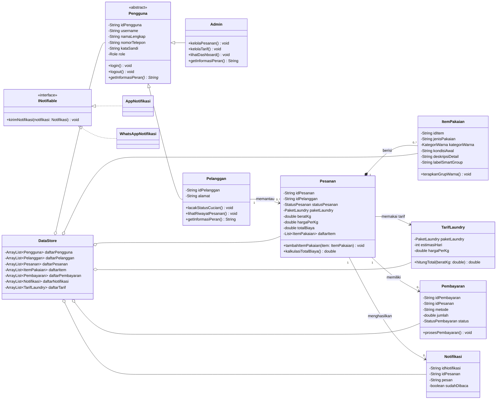
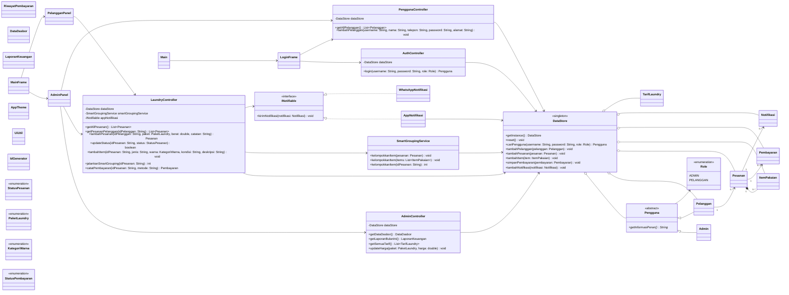

# SILAUNDRY - Sistem Informasi Manajemen Laundry

SILAUNDRY adalah aplikasi desktop Java Swing untuk membantu simulasi operasional laundry. Project ini berfokus pada penerapan materi Pemrograman Berorientasi Objek dan menggunakan `ArrayList` sebagai penyimpanan sementara.

Program tidak memakai database. Seluruh akun pelanggan, pesanan, item pakaian, pembayaran, dan notifikasi akan kembali kosong ketika aplikasi ditutup.

## Role Pengguna

### Admin

- Login menggunakan akun awal.
- Melihat dashboard dan laporan.
- Melihat pelanggan yang sudah register.
- Membuat dan mengubah status pesanan.
- Mencatat detail pakaian.
- Menjalankan smart grouping.
- Mencatat pembayaran.
- Mengatur tarif laundry.
- Membuat template link WhatsApp.

### Pelanggan

- Membuat akun melalui menu register.
- Login menggunakan akun yang baru dibuat.
- Melihat pesanan aktif miliknya.
- Melihat riwayat pesanan.
- Melihat dan membaca notifikasi.

## Akun Awal

| Role | Nama | Username | Password |
|---|---|---|---|
| Admin | Master Admin | `masteradmin` | `123456` |

Saat aplikasi pertama kali dijalankan, hanya akun Admin tersebut yang tersedia. Akun pelanggan ditambahkan ke `ArrayList` melalui menu register.

## Penyimpanan Data

Class `DataStore` menyimpan collection berikut:

```java
ArrayList<Pengguna> daftarPengguna;
ArrayList<Pelanggan> daftarPelanggan;
ArrayList<Pesanan> daftarPesanan;
ArrayList<ItemPakaian> daftarItem;
ArrayList<Pembayaran> daftarPembayaran;
ArrayList<Notifikasi> daftarNotifikasi;
ArrayList<TarifLaundry> daftarTarif;
```

`DataStore` dibuat sebagai singleton agar semua controller dan halaman GUI memakai objek data yang sama selama aplikasi berjalan.

## Materi OOP

| Materi | Implementasi |
|---|---|
| Abstract class | `Pengguna` |
| Inheritance | `Admin` dan `Pelanggan` mewarisi `Pengguna` |
| Abstract method | `Pengguna.getInformasiPeran()` |
| Overriding | Implementasi `getInformasiPeran()`, `kirimNotifikasi()`, dan `toString()` |
| Overloading | Constructor `Pembayaran` dan method `SmartGroupingService.kelompokkanItem()` |
| Interface | `INotifiable` |
| Polymorphism | `INotifiable` dapat berisi `AppNotifikasi` atau `WhatsAppNotifikasi` |
| Encapsulation | Atribut private dengan getter dan setter |
| Collection | Data disimpan dalam beberapa `ArrayList` |
| Composition | `Pesanan` memiliki daftar `ItemPakaian` |
| Association | Pesanan terhubung dengan Pelanggan |
| Enum | Role, status pesanan, paket, warna, dan status pembayaran |
| Exception handling | Validasi input menggunakan `IllegalArgumentException` |
| GUI | Swing, event listener, table, form, sidebar, dan dialog |

Project mempunyai 27 class utama, 2 interface, dan 6 enum sehingga memenuhi ketentuan minimal 15 class.

## Core Class Diagram

Diagram core menampilkan class domain yang paling penting untuk pembahasan OOP.



## Final Class Diagram

Diagram final menunjukkan hubungan model, collection, controller, service, dan GUI pada implementasi saat ini.



## Struktur Project

```text
src/silaundry/
  controller/
  data/
  model/
  model/enums/
  service/
  util/
  view/
test/silaundry/test/
```

## Cara Menjalankan di NetBeans

1. Buka Apache NetBeans.
2. Pilih **File > Open Project**.
3. Pilih folder project SILAUNDRY.
4. Klik kanan project lalu pilih **Clean and Build**.
5. Jalankan main class `silaundry.Main`.

Program tidak membutuhkan XAMPP, MySQL, Connector/J, atau konfigurasi tambahan.

## Alur Presentasi

1. Jalankan aplikasi.
2. Tunjukkan bahwa role Admin dan Pelanggan tersedia.
3. Register satu akun pelanggan.
4. Login sebagai Admin menggunakan `masteradmin` / `123456`.
5. Buat pesanan untuk pelanggan yang baru register.
6. Tambahkan detail item pakaian.
7. Jalankan smart grouping.
8. Ubah status pesanan secara berurutan.
9. Catat pembayaran.
10. Logout dan login sebagai pelanggan.
11. Tampilkan pesanan aktif, riwayat, dan notifikasi pelanggan.
12. Jelaskan bahwa seluruh data berada di `ArrayList` dan hilang saat aplikasi ditutup.

## Pengujian

Compile melalui PowerShell:

```powershell
$files = @(rg --files src test | Where-Object { $_ -like '*.java' })
javac -encoding UTF-8 -d build\classes $files
```

Jalankan test:

```powershell
java -cp build\classes silaundry.test.BusinessRulesTest
```

Test mensimulasikan login Admin, register dan login pelanggan, pesanan, item pakaian, smart grouping, status, notifikasi, pembayaran, dan dashboard.

## Batasan

- Data hanya tersedia selama aplikasi berjalan.
- Data tidak disimpan ke file atau database.
- Aplikasi ditujukan sebagai simulasi tugas besar, bukan sistem produksi.
- Link WhatsApp hanya berupa template dan tidak dikirim otomatis melalui API.

## Mata Kuliah

- Mata Kuliah: Pemrograman Berorientasi Objek
- Institusi: Telkom University
- Tahun: 2026

Project ini dibuat untuk keperluan akademis Tugas Besar Pemrograman Berorientasi Objek.
